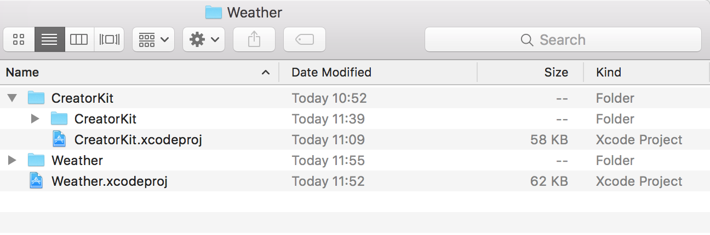
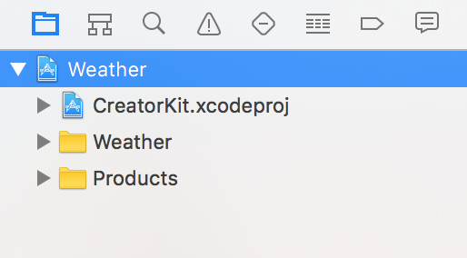
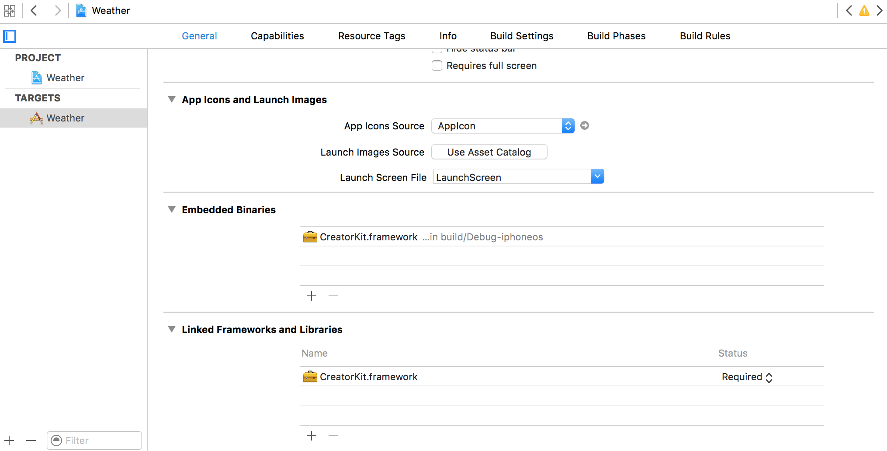
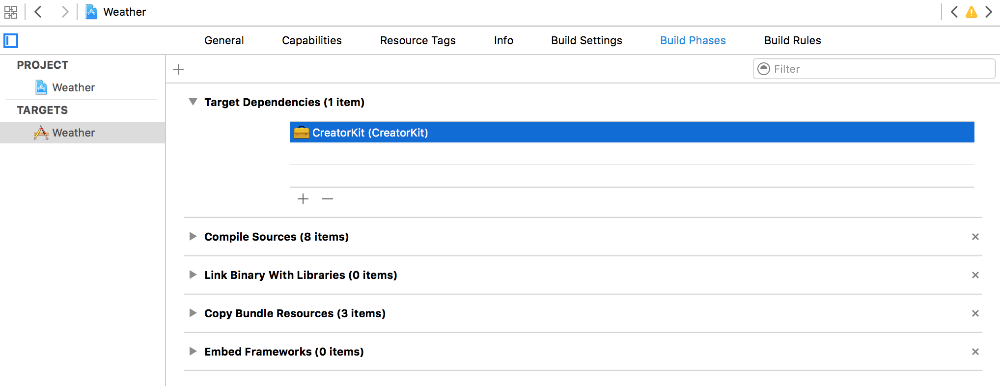
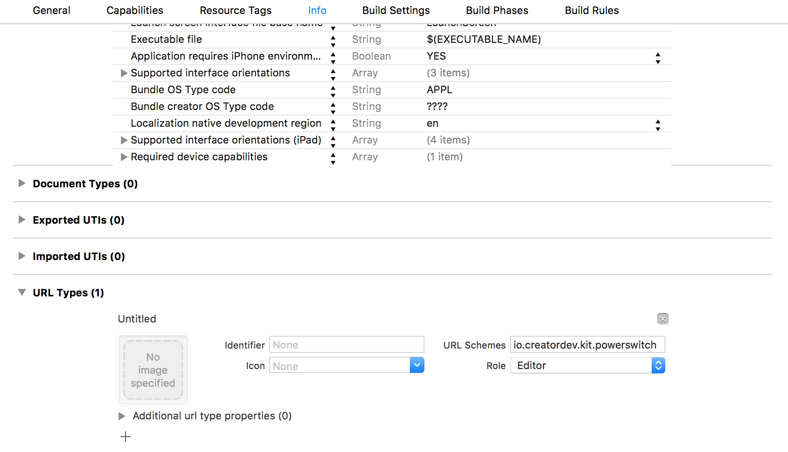
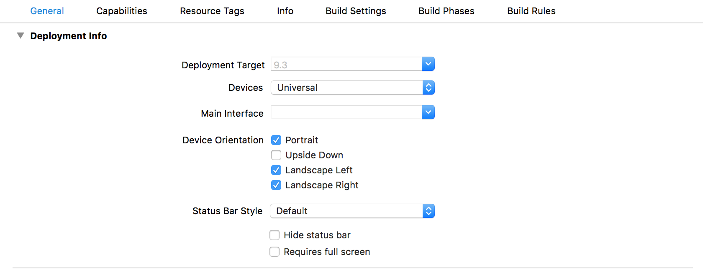

# CreatorKit framework integration with new Xcode project 
Follow steps below to integrate CreatorKit login and core functionality into your project.


1. Copy CreatorKit directory into your project structure.

    
2. Add CreatorKit.xcodeproj into your project.

    
3. In Project -> General -> Embedded Binaries add CreatorKit framework. It will be also added to Build Phases.

     

    
4. In Project -> Info -> URL Types add your URL Scheme.

    
5. Remove Main Interface storyboard from Project -> General -> Main Interface.

    
6. Adapt AppDelegate class, so it contains:

    ```objc
    // AppDelegate.h

    @import UIKit;
    #import <CreatorKit/LoginDelegate.h>
    #import <CreatorKit/OpenUrlProtocol.h>

    @interface AppDelegate : UIResponder <UIApplicationDelegate, LoginDelegate>
    @property (strong, nonatomic, nonnull) UIWindow *window;
    @property(nonatomic, weak, nullable) id<OpenUrlProtocol> openUrlDelegate;
    @end
    ```

    ```objc
    // AppDelegate.m

    #import "AppDelegate.h"
    #import <CreatorKit/GlobalStyle.h>
    #import <CreatorKit/LoginApi.h>

    @implementation AppDelegate
    @synthesize authenticateToken = _authenticateToken;

    - (BOOL)application:(UIApplication *)application didFinishLaunchingWithOptions:(NSDictionary *)launchOptions {
      [[GlobalStyle class] setupAppearance];

      NSURL *launchUrl = launchOptions[UIApplicationLaunchOptionsURLKey];
      if (launchUrl) {
        self.authenticateToken = [[LoginApi class] tokenFromURL:launchUrl redirectUrlScheme:self.creatorRedirectUrlScheme];
      }

      self.window = [[UIWindow alloc] initWithFrame:UIScreen.mainScreen.bounds];
      self.window.rootViewController = [[LoginApi class] loginViewControllerWithLoginDelegate:self];
      [self.window makeKeyAndVisible];

      return YES;
    }

    - (BOOL)application:(UIApplication *)app openURL:(NSURL *)url options:(NSDictionary<NSString *,id> *)options {
      if (self.openUrlDelegate) {
        return [self.openUrlDelegate processOpenUrl:url source:self];
      }
      return NO;
    }

    #pragma mark - OpenUrlProtocol

    - (UIViewController *)safariRootViewController {
      return self.window.rootViewController;
    }

    - (NSString *)creatorRedirectUrlScheme {
      return @"io.creatordev.kit.powerswitch"; // TODO:change to your Redirect URL Scheme
    }

    - (void)presentMainViewControllerWithDeviceServerApi:(nonnull DeviceServerApi *)deviceServerApi {
      UIStoryboard *mainStoryboard = [UIStoryboard storyboardWithName:@"Main" bundle:nil];
      self.window.rootViewController = [mainStoryboard instantiateInitialViewController];;
    }

    @end
    ```

7. Now Your project contains CreatorKit login procedure. You could add logout action somewhere in your application:

    ```objc
    - (IBAction)logoutAction:(id)sender {
      [[LoginApi class] logout];
      AppDelegate *appDelegate = (AppDelegate *)[UIApplication sharedApplication].delegate;
      appDelegate.window.rootViewController = [[LoginApi class] loginViewControllerWithLoginDelegate:appDelegate];
    }
    ```
